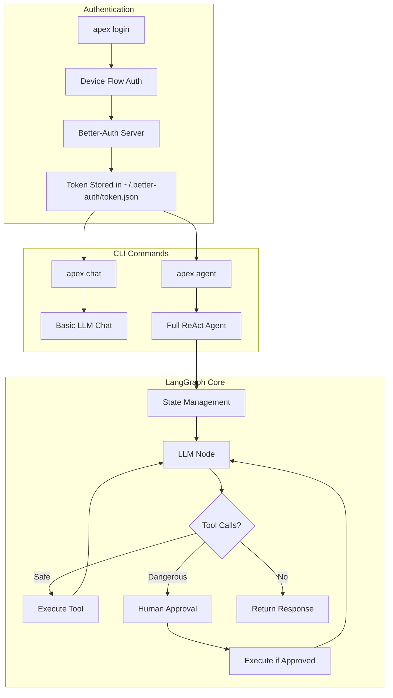
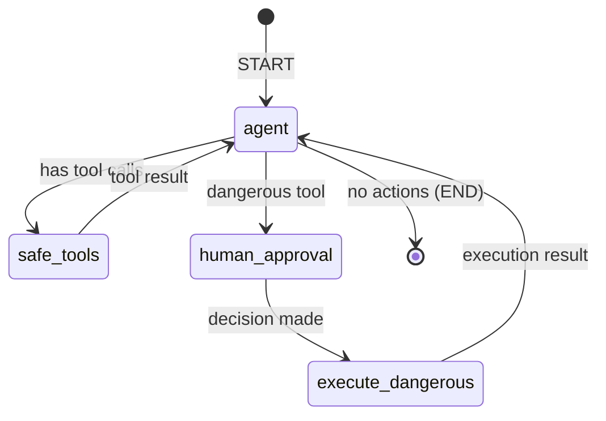
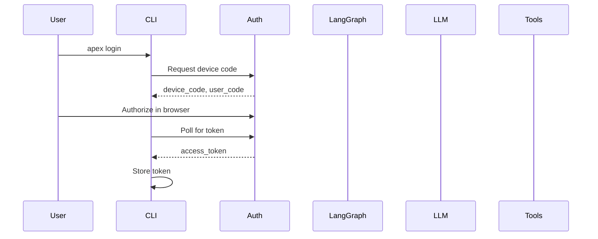
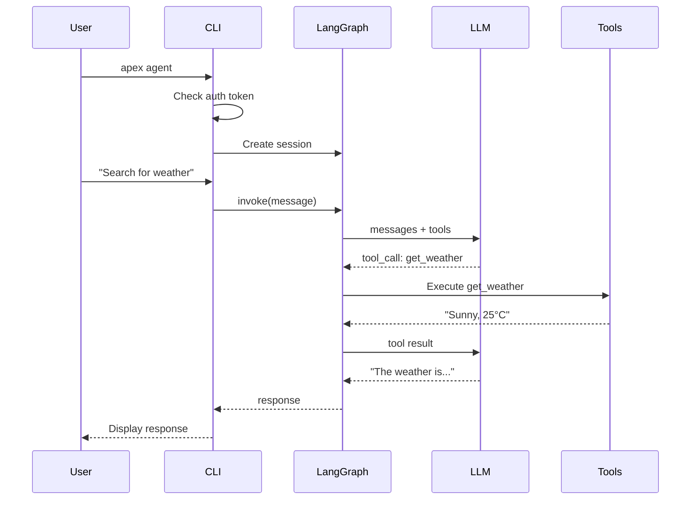

# Apex CLI - Complete Architecture Walkthrough

This document explains the complete flow of the Apex CLI from authentication to AI agent execution.

## Overview



---

## File Structure

```
server/src/
├── cli/
│   ├── main.js              # CLI entry point
│   └── commands/
│       ├── auth/
│       │   └── login.js     # Device flow authentication
│       ├── chat.js          # Basic chat command
│       ├── agent.js         # Full agent command
│       └── config.js        # API key management
├── config/
│   └── google.config.js     # Configuration loader
└── lib/
    └── langgraph/
        ├── index.js         # Module exports
        ├── state.js         # State schema
        ├── llm.js           # LLM configuration
        ├── tools.js         # Tool definitions
        ├── nodes.js         # Graph nodes
        ├── graph.js         # Graph builder
        └── session.js       # Session management
```

---

## Step-by-Step Flow

### 1. Authentication: Device Flow

**File:** [login.js](file:///c:/d-driver/Ai%20agent%20cli/Apex-cli/server/src/cli/commands/auth/login.js)

When you run `apex login`:

1. **Request Device Code**
   - Client calls Better-Auth server's `/device/code` endpoint
   - Server returns `device_code`, `user_code`, and `verification_uri`

2. **User Authorization**
   - User visits the verification URL
   - Enters the user code
   - Grants permission via browser

3. **Token Poll**
   - CLI polls `/device/token` until authorization completes
   - Upon success, access token is stored in `~/.better-auth/token.json`

```javascript
// Key functions in login.js
export async function getStoredToken()    // Read saved token
export async function storeToken(token)   // Save token to disk
export async function requireAuth()       // Check auth before commands
```

---

### 2. Configuration Loading

**File:** [google.config.js](file:///c:/d-driver/Ai%20agent%20cli/Apex-cli/server/src/config/google.config.js)

Configuration priority:
1. `~/.apex-cli/config.json` (set via `apex config set`)
2. Environment variables
3. Default values

| Key | Description | Default |
|-----|-------------|---------|
| `GOOGLE_API_KEY` | Gemini API key | Required |
| `ORBITAL_MODEL` | Model name | `gemini-2.0-flash` |
| `dangerousTools` | Tools needing approval | shell, write, delete, http |

---

### 3. LangGraph State

**File:** [state.js](file:///c:/d-driver/Ai%20agent%20cli/Apex-cli/server/src/lib/langgraph/state.js)

The state flows through the entire graph:

```javascript
export const AgentState = Annotation.Root({
  messages: Annotation({...}),        // Conversation history (append)
  sessionId: Annotation({...}),       // Unique session ID
  pendingToolCall: Annotation({...}), // Tool awaiting approval
  toolApproved: Annotation({...}),    // User's approval decision
  iterations: Annotation({...}),      // Loop counter
  error: Annotation({...}),           // Error state
});
```

---

### 4. LLM Configuration

**File:** [llm.js](file:///c:/d-driver/Ai%20agent%20cli/Apex-cli/server/src/lib/langgraph/llm.js)

Creates the Gemini LLM instance:

```javascript
export function createLLM() {
  return new ChatGoogleGenerativeAI({
    model: config.model,
    temperature: config.temperature,
    maxOutputTokens: config.maxOutputTokens,
    apiKey: config.googleApiKey,
  });
}

export function createLLMWithTools(tools) {
  const llm = createLLM();
  return llm.bindTools(tools);
}
```

---

### 5. Tool Definitions

**File:** [tools.js](file:///c:/d-driver/Ai%20agent%20cli/Apex-cli/server/src/lib/langgraph/tools.js)

| Tool | Category | Description |
|------|----------|-------------|
| `calculator` | Safe | Math operations |
| `get_weather` | Safe | Weather info (simulated) |
| `read_file` | Safe | Read file contents |
| `list_directory` | Safe | List folder contents |
| `get_current_time` | Safe | Current date/time |
| `web_search` | Safe | Web search (simulated) |
| `write_file` | ⚠️ Dangerous | Write to files |
| `shell_command` | ⚠️ Dangerous | Execute commands |
| `delete_file` | ⚠️ Dangerous | Delete files |
| `http_request` | ⚠️ Dangerous | Make HTTP requests |

---

### 6. Graph Nodes

**File:** [nodes.js](file:///c:/d-driver/Ai%20agent%20cli/Apex-cli/server/src/lib/langgraph/nodes.js)

| Node | Purpose |
|------|---------|
| [agentNode](file:///c:/d-driver/Ai%20agent%20cli/Apex-cli/server/src/lib/langgraph/nodes.js#34-103) | Main LLM reasoning - calls model with messages |
| `safeToolNode` | Executes safe tools automatically |
| [humanApprovalNode](file:///c:/d-driver/Ai%20agent%20cli/Apex-cli/server/src/lib/langgraph/nodes.js#117-165) | Prompts user for dangerous tool approval |
| [executeDangerousToolNode](file:///c:/d-driver/Ai%20agent%20cli/Apex-cli/server/src/lib/langgraph/nodes.js#170-240) | Runs approved dangerous tools |

**Routing Logic:**

```javascript
export function routeAfterAgent(state) {
  if (state.error) return "end";
  if (state.pendingToolCall) return "needs_approval";
  if (lastMessage?.tool_calls?.length > 0) return "call_tools";
  return "end";
}
```

---

### 7. Graph Construction

**File:** [graph.js](file:///c:/d-driver/Ai%20agent%20cli/Apex-cli/server/src/lib/langgraph/graph.js)



---

### 8. Session Management

**File:** [session.js](file:///c:/d-driver/Ai%20agent%20cli/Apex-cli/server/src/lib/langgraph/session.js)

**FileCheckpointer** provides persistence:
- Saves state to `~/.apex-cli/sessions/<session-id>.json`
- Loads previous conversation on session resume
- Enables long-running conversations across CLI restarts

**AgentSession** wraps the graph:
```javascript
class AgentSession {
  constructor(sessionId)        // Create or resume session
  async chat(message)           // Send message, get response
  async *stream(message)        // Stream response chunks
  static async listSessions()   // List all sessions
  static async deleteSession()  // Delete a session
}
```

---

### 9. CLI Commands

#### Chat Command

**File:** [chat.js](file:///c:/d-driver/Ai%20agent%20cli/Apex-cli/server/src/cli/commands/chat.js)

Basic chat without tools:
- Streaming responses
- Typing indicators
- Token counting
- Session memory

```bash
apex chat                    # New session
apex chat --session my-chat  # Resume session
apex chat --list             # List sessions
```

#### Agent Command

**File:** [agent.js](file:///c:/d-driver/Ai%20agent%20cli/Apex-cli/server/src/cli/commands/agent.js)

Full ReAct agent with tools:
- Human-in-the-loop for dangerous actions
- Progress visualization
- Verbose mode for debugging

```bash
apex agent                    # Start agent
apex agent --verbose          # Detailed logs
apex agent --session my-agent # Resume session
```

#### Config Command

**File:** [config.js](file:///c:/d-driver/Ai%20agent%20cli/Apex-cli/server/src/cli/commands/config.js)

Manage API keys:

```bash
apex config set GOOGLE_API_KEY <key>  # Set API key
apex config list                       # Show all config
apex config get GOOGLE_API_KEY        # Get specific key
```

---

## Data Flow Diagram

````carousel

<!-- slide -->

````

---

## Quick Reference

| Command | Description |
|---------|-------------|
| `apex login` | Authenticate with device flow |
| `apex logout` | Clear stored credentials |
| `apex whoami` | Show current user |
| `apex config set KEY VALUE` | Set configuration |
| `apex config list` | Show all config |
| `apex chat` | Basic AI chat |
| `apex agent` | Full AI agent with tools |
| `apex agent --verbose` | Agent with debug logs |
| `apex agent --list` | List saved sessions |

---

## Storage Locations

| What | Path |
|------|------|
| Auth token | `~/.better-auth/token.json` |
| Config file | `~/.apex-cli/config.json` |
| Sessions | `~/.apex-cli/sessions/*.json` |
